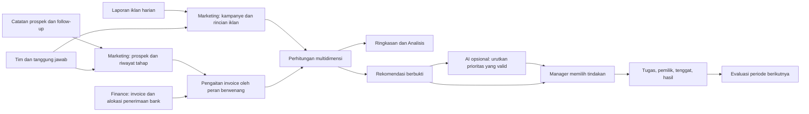

# Arsitektur Marketing OSEE: dari prospek menuju cash-in

Tanggal: 8 September 2026. Dokumen ini menguraikan keputusan arsitektur untuk implementasi Django dalam folder `marketing/`. Status pengujian dan batas rilis dicatat di bagian akhir. Acuan: [arsitektur Direktur](DIRECTOR-MODULE-ARCHITECTURE.md) dan kode Finance yang sudah tersedia.

## Capability

Tim marketing dapat membaca hasil tanpa membuat rumus, memilih sudut analisis, mengetahui hambatan yang dapat ditindaklanjuti, dan mencatat tindak lanjutnya. Manager dapat mengevaluasi pengelolaan iklan dan penanganan prospek dengan konteks yang adil. Ukuran hasil akhirnya adalah penerimaan pelanggan yang dibuktikan oleh alokasi Finance ke mutasi bank, dengan transparansi atas data yang belum lengkap. Perbaikan cash-in merupakan sasaran bisnis yang harus diukur setelah digunakan, bukan hasil yang otomatis dijamin aplikasi atau AI.

Alur kerja harian: lihat Ringkasan → pilih masalah prioritas → periksa Analisis → kerjakan Prospek atau Iklan → tetapkan tindakan di Saran Manager → catat hasil dan evaluasi pada periode berikutnya.

## Constraints

- Finance tetap memiliki invoice, rekonsiliasi penerimaan, jurnal, dan mutasi bank. Marketing hanya membaca hasil rekonsiliasi dan menyimpan hubungan prospek dengan invoice.
- Cash-in bruto terverifikasi dihitung dari `finance.Allocation.amount` pada `Allocation.transaction.date`. Transfer belum teralokasi, modal, pinjaman, laporan konversi platform, nilai invoice, dan rekap PDF tidak ditambahkan ke angka ini.
- Finance saat ini belum memiliki alur refund, pembalikan alokasi, atau uang muka sebelum invoice. Cash-in neto dan laba tidak boleh disimpulkan dari cash-in bruto.
- Satu invoice hanya mempunyai satu prospek sumber pada versi awal. Ini merupakan atribusi sumber tunggal yang dinyatakan eksplisit, bukan klaim pembuktian kontribusi kausal maupun atribusi multi-touch.
- Satu invoice boleh menerima beberapa cicilan dan satu mutasi boleh membayar beberapa invoice. Setiap alokasi dihitung sekali; join ke beberapa baris iklan tidak boleh memperbanyak kas.
- Kolom kosong berarti belum diketahui. Nilai nol hanya berlaku ketika sumber atau kumpulan kejadian yang tercatat memang menghasilkan nol. Ketiadaan catatan tidak membuktikan kelengkapan buku atau kegiatan seluruh perusahaan.
- Seluruh pembacaan dan perubahan dibatasi organisasi dan peran. Data pelanggan, nama tim, catatan bebas, dan mutasi bank tidak dikirim sebagai prompt AI.
- Setiap perubahan operasional melalui layanan tervalidasi, transaksi database, dan audit. Data lama tidak diubah menjadi kampanye atau transaksi hasil tebakan.

## Implementation contract

### Posisi dalam ERP

Implementasi menggunakan aplikasi Django modular di deployment yang sama. Template server, ORM, validasi, sesi, CSRF, audit, dan format rupiah mengikuti ERP. Perhitungan dilakukan saat permintaan dengan sumber yang sudah tersimpan. Belum diperlukan warehouse, microservices, vector database, dispatcher event, atau sinkronisasi akun iklan untuk menggunakan alur manual ini.

### Dimensi dan arti perbandingannya

| Dimensi | Pertanyaan manager | Sumber dan batas |
|---|---|---|
| Waktu | Apa yang berubah selama tanggal terpilih? | Iklan menurut tanggal laporan, prospek menurut waktu masuk, penerimaan menurut tanggal mutasi. Basis tersebut ditulis di layar. |
| Kanal | Kanal mana menghasilkan prospek dan kas yang tercatat? | Kanal kampanye/prospek; WhatsApp sebagai asal hanya jika diketahui, bukan menimpa asal iklan karena percakapan beralih ke WA. |
| Kampanye | Kampanye mana perlu diperbaiki atau diuji? | Relasi kampanye eksplisit. Nama kampanye dalam referensi laporan lama tidak dipetakan otomatis. |
| Produk | Bagaimana hasil ITP, iBT, atau kursus? | Produk ERP yang dipilih pada kampanye/prospek dan cocok dengan invoice. |
| Penanggung jawab | Siapa perlu dukungan pada penanganan prospek? | Pemilik prospek; berbeda dari pengelola kampanye. Biaya iklan tidak dibebankan kepada penanggung jawab penjualan secara sembarang. |
| Segmen | Apakah direct, reseller, dan institusi memiliki pola berbeda? | Segmen prospek; peserta tes bukan pembeli unik. Biaya tidak dibagi rata ke segmen tanpa bukti alokasi. |
| Wilayah | Dari wilayah mana prospek yang tercatat berasal? | Wilayah prospek dan wilayah target iklan merupakan informasi berbeda. Ketersediaan ukuran mengikuti kesesuaian sumber. |
| Iklan | Materi iklan mana memperoleh klik dengan biaya tertentu? | Nama iklan dalam kampanye pada laporan harian. Kas per iklan memerlukan pengaitan konversi sampai iklan; tanpa itu hanya metrik iklannya yang tersedia. |
| Audiens | Bagaimana laporan target audiens iklan dicatat? | Disimpan pada rincian sumber iklan. Ini bukan inferensi atribut pribadi prospek. Eksplorasi hasil kas sampai audiens menunggu pengaitan yang terbukti. |

Filter memakai pilihan yang dibatasi sistem, bukan SQL atau rumus bebas. Angka tidak kompatibel dengan filter diberi alasan tidak tersedia. Total rasio dihitung ulang dari pembilang dan penyebut yang sesuai, bukan rata-rata rasio setiap baris. Jika kas mempunyai produk prospek tetapi biaya kampanyenya belum memiliki alokasi produk, biaya yang diketahui tetap terlihat dan rasio per produk ditahan. Rasio juga ditahan ketika kampanye pembawa kas belum mempunyai bukti biaya periode itu; ketiadaan laporan bukan biaya nol. Nol yang terverifikasi dapat dicatat secara eksplisit.

### Grain, identitas, dan kepemilikan data

| Catatan | Satu baris berarti | Aturan penting |
|---|---|---|
| `TeamMember` | Profil tanggung jawab anggota tim | Profil evaluasi bukan akun login atau izin. Disiplin media buyer, konten, sales, kemitraan, manager membantu pembacaan konteks. |
| `Campaign` | Satu kampanye dengan kanal, produk, dan pengelola | Identitas dimensi dipertahankan agar hasil historis tidak berpindah diam-diam. |
| `AdDailyObservation` | Kampanye × tanggal × iklan × audiens × wilayah | Biaya, tayangan, klik nullable; referensi sumber dan versi koreksi. Jangan memasukkan total kampanye bersamaan dengan rinciannya sebagai dua biaya. |
| `Lead` | Satu prospek/opportunity dengan referensi unik organisasi | Waktu masuk, asal, produk, segmen, penanggung jawab, tahap, respons, dan jadwal follow-up. Tidak dimaksudkan sebagai direktori identitas pelanggan unik lintas semua interaksi. |
| `LeadStageEvent` | Satu perubahan tahap prospek | Riwayat tahap tidak dihapus oleh perubahan status terakhir. |
| Relasi `Lead.invoice` | Invoice ERP yang terbukti terkait prospek | Maksimal satu prospek sumber per invoice. Pengaitan diperiksa terhadap organisasi, pelanggan/mitra, produk, dan status invoice. |
| `finance.Allocation` | Satu bagian penerimaan bank yang melunasi invoice | Dibaca saja. Tanggal mutasi menentukan periode cash-in, bukan tanggal pencatatan lead atau impor. |
| `MarketingAction` | Satu tindakan dengan bukti dan pemilik | Tenggat, status, versi, dan hasil; bukan persetujuan perubahan anggaran atau perintah ke platform iklan. |
| `MarketingAIPolicy` | Persetujuan terpisah organisasi untuk agregat marketing | Opt-in pemilik dan konfigurasi deployment diperlukan; persetujuan AI Direktur tidak otomatis berlaku. |
| `director.MarketingObservation` | Laporan ringkas kanal dari sistem sebelumnya | Tetap sebagai laporan sumber terpisah, termasuk impor CSV, koreksi, dan riwayatnya. |

Fakta biaya dan fakta penerimaan diagregasi secara terpisah sebelum disandingkan. Tidak ada tabel buku marketing kedua. Bila skala data membutuhkan agregat terjadwal nanti, gunakan kunci organisasi, versi rumus, waktu sumber, dan idempotensi; jangan mengandalkan outbox yang belum mempunyai consumer.

### Kamus metrik

| Metrik | Rumus atau basis | Interpretasi |
|---|---|---|
| Cash-in bruto terverifikasi | Jumlah alokasi penerimaan pada periode kas | Baru dikaitkan ke marketing jika invoice mempunyai prospek sumber. Bukan saldo bank atau laba. |
| Cakupan pengaitan kas | Kas dengan sumber prospek / seluruh alokasi penerimaan dalam cakupan pembanding | Kas belum terpetakan terlihat; peningkatan cakupan bukan pertumbuhan penerimaan baru. |
| Biaya iklan dilaporkan | Jumlah biaya unik dari rincian laporan | Belum sama dengan uang yang dibayarkan Finance; nilai kosong dan sumber yang belum masuk ditandai. |
| Tayangan, klik, biaya per klik | Tayangan, klik, biaya / klik yang tercatat | Pembagian nol atau biaya/klik tidak lengkap tidak menghasilkan rasio pasti. |
| Prospek masuk | Jumlah prospek pada periode masuk | Referensi mencegah pengulangan catatan yang sama; tidak menjamin deduplikasi orang tanpa integrasi identitas. |
| Konversi prospek membayar | Prospek dalam cohort yang mempunyai penerimaan s.d. akhir pengamatan / prospek cohort | Pembayaran parsial tetap pembayaran; cohort baru belum matang. Tidak membagi uang periode ini dengan lead periode lain. |
| Respons pertama | Selisih waktu respons pertama dengan waktu masuk | Median lebih tahan terhadap beberapa kasus ekstrem; tampilkan cakupan data respons. |
| Follow-up terlambat | Prospek aktif dengan jadwal lewat dan belum ditutup | Antrean tindakan saat ini; bukan ukuran historis SLA tanpa riwayat penjadwalan. |
| Kas dibanding biaya periode | Cash-in terkait / biaya tercatat dengan dimensi dan tanggal kompatibel | Ukuran diagnostik arus kas, bukan ROAS kausal, laba, atau payback akuisisi. Lead bulan lalu dapat membayar bulan ini. |
| Cash-in neto, CAC pembeli baru, laba kontribusi | Belum disimpulkan dari sumber yang ada | Memerlukan refund, identitas pembeli/cohort, dan biaya layanan yang sesuai. |

Tampilan uang memakai rupiah dan Decimal. Periode kalender menggunakan Asia/Jakarta. Rekomendasi dan hasil ekspor harus mempertahankan tanggal, filter, dasar metrik, serta batas data agar konteks tidak hilang.

### Pengalaman tim nonteknis

| Layar | Hasil yang diperoleh | Tindakan |
|---|---|---|
| Ringkasan | Kas terkait, biaya, prospek, dan prioritas yang perlu ditangani | Buka analisis atau antrean prospek. |
| Analisis | Tabel menurut dimensi dengan filter dan penjelasan singkat | Ubah sudut pandang, periksa ukuran yang tersedia. |
| Prospek | Daftar kerja dengan tahap dan jadwal follow-up | Tambah prospek, catat respons, ubah tahap, kaitkan invoice melalui peran berwenang. |
| Iklan | Kampanye dan rincian hasil per tanggal | Tambah kampanye, catat/koreksi laporan berdasarkan sumber. |
| Tim | Profil penanggung jawab dan disiplin | Catat anggota sebelum menetapkan kepemilikan. |
| Saran Manager | Prioritas dengan bukti, tindakan, dan ukuran evaluasi | Tetapkan tugas, tenggat, lalu catat hasil. |

Utamakan pilihan dropdown, label singkat Bahasa Indonesia, bantuan dekat isian, tampilan ponsel, navigasi keyboard, dan tabel yang dapat digulir tanpa membuat seluruh halaman melebar. Saat data kosong, tampilkan langkah pertama yang dapat dikerjakan; jangan mengisi perusahaan dengan angka demo.

Evaluasi tim tidak memakai leaderboard tunggal sebagai penilaian karyawan. Pisahkan tugas akuisisi, kualitas prospek, penanganan, dan penagihan. Periksa mix kanal/produk/segmen, jumlah observasi, kematangan cohort, dan kelengkapan pencatatan sebelum menyimpulkan seseorang berkinerja buruk. Status “won” dari sales tidak otomatis membuktikan pembayaran.

### AI dan tindak lanjut manager

Perhitungan metrik dan deteksi bukti dimiliki kode. Mode lokal menghasilkan saran berbasis aturan dan secara eksplisit menyatakan bahwa model AI belum digunakan. Mode OpenRouter opsional mengurutkan rekomendasi yang sudah lolos pemeriksaan; model tidak menentukan angka, pelanggan yang harus dihubungi, status pembayaran, atau tindakan eksternal.

Format rekomendasi: masalah → bukti dan cakupan → tindakan yang disarankan → keterbatasan → metrik evaluasi. Manager menentukan pemilik dan tenggat serta mencatat hasil. Penyelesaian tugas tidak otomatis dianggap meningkatkan cash-in; hasil bisnis perlu dibandingkan dengan baseline yang sebanding, dan hubungan sebab-akibat memerlukan eksperimen yang memadai.

Contoh logika, bukan temuan tentang perusahaan saat ini:

- Banyak prospek mempunyai follow-up terlambat: dahulukan pemulihan antrean dan ukur jumlah yang ditindaklanjuti serta penerimaan sesudahnya.
- Penerimaan terverifikasi belum mempunyai asal prospek: minta pengaitan oleh Finance sebelum memutuskan alokasi budget kanal.
- Biaya iklan ada tetapi informasi klik atau kas tidak memadai: lengkapi pengukuran dan evaluasi kampanye dengan sampel sebanding.
- Respons tim belum lengkap atau cohort kecil: sarankan pembenahan data/coaching; hindari menyebut satu anggota sebagai penyebab penurunan cash-in.

Outbound AI harus berisi hanya nilai agregat yang diizinkan dan kode rekomendasi. Pertanyaan, nama pelanggan, nama tim, kampanye bebas, kontak, dokumen, dan riwayat percakapan tetap lokal. Respons terstruktur divalidasi ulang; respons tidak sah, endpoint tidak tersedia, budget habis, atau izin dicabut kembali ke saran lokal. Reservasi biaya dan status permintaan tidak boleh dihapus hanya karena hasil jaringan tidak diketahui.

Provider ditetapkan melalui konfigurasi backend, dengan fallback routing dimatikan, parameter didukung, permintaan tanpa data collection dan ZDR. Dukungan parameter bergantung endpoint dan harus diuji ketika koneksi nyata disiapkan, sesuai [provider routing OpenRouter](https://openrouter.ai/docs/guides/routing/provider-selection) dan [structured outputs](https://openrouter.ai/docs/guides/features/structured-outputs). Pengaturan ini bukan jaminan biaya atau kebenaran rekomendasi.

### Izin dan lifecycle

Peran `owner`, `director`, `finance`, dan `marketing` memakai workspace marketing bersama. `auditor` membaca tanpa perubahan. Profil anggota tim tidak mengubah hak akses. Versi awal belum menerapkan pemisahan data per anggota atau peran akun marketing-manager terpisah; jangan menampilkan privasi per anggota yang belum ditegakkan.

Pengaitan invoice hanya untuk `owner`, `director`, atau `finance`; ini tidak memperluas hak mereka untuk membukukan transaksi Finance. Penerbitan dan rekonsiliasi tetap tunduk pada layanan Finance. Hanya pemilik organisasi mengubah kebijakan outbound AI Marketing. Data kelompok lain, tabel bank mentah, biaya perusahaan di luar marketing, dan konfigurasi rahasia tidak tersedia lewat workspace marketing.

Prospek dapat dicatat sebagai baru, dihubungi, sesuai kebutuhan, penawaran, sepakat membeli, atau tidak lanjut. Tahap dapat dibuka kembali dan koreksinya tercatat; ini bukan funnel yang dipaksa selalu maju. Riwayat tahap mencatat waktu penyimpanan, bukan mengarang tanggal kejadian masa lalu. Pembayaran merupakan bukti terpisah melalui Finance. Prospek sepakat membeli yang belum lunas tetap masuk antrean follow-up jika jadwalnya lewat. Tugas: terbuka → dikerjakan → selesai atau tidak dilanjutkan, dengan catatan hasil/alasan. Pembaruan memakai versi agar tab lama tidak menimpa perubahan terbaru.

Data bertanggal masa depan tidak diperlakukan sebagai aktual yang sudah terjadi. Batas pengamatan paling akhir adalah hari ini di WIB. Perbandingan memakai jumlah hari pengamatan yang sama; pilihan bulan berjalan yang belum selesai tidak dibandingkan dengan satu bulan penuh. Jam respons belum disesuaikan kalender kerja/SLA perusahaan.

## Non-goals dan batas rilis

- Tidak membuat koneksi otomatis Meta Ads, Google Ads, WhatsApp, CRM, bank, atau pengiriman pesan pelanggan pada rilis ini. Akun/API belum diberikan. Pencatatan manual dan impor CSV rincian iklan per kampanye tersedia (UTF-8, 1 MB, 500 baris, validasi atomik, pengulangan identik aman); impor CSV kanal sebelumnya tetap terpisah.
- Tidak menyalakan/mematikan iklan, menaikkan budget, membayar, mengirim pesan, atau menyetujui kebijakan melalui AI. Persetujuan anggaran tetap dimiliki modul Direktur.
- Tidak mengubah rekap 2026 menjadi penerimaan bank atau invoice buatan.
- Tidak menyatakan pembuktian incremental lift, atribusi multi-touch, lifetime value, atau keputusan HR otomatis.
- Belum ada worker sinkronisasi, warehouse, atau validasi konkurensi PostgreSQL dalam lingkungan lokal SQLite.
- Satu prospek hanya dapat terhubung ke satu invoice. Pembelian ulang/multi-invoice dan koreksi pengaitan yang salah belum mempunyai workflow. Identitas kampanye, asal, penanggung jawab awal, segmen, dan wilayah prospek dipertahankan; belum ada layanan pemindahan owner atau koreksi dimensi asal. Produk/pembeli yang awalnya belum diketahui dapat dilengkapi dari invoice setelah konfirmasi eksplisit peran berwenang.
- Tumpang tindih total dengan rincian iklan ditolak, tetapi nama audiens/wilayah bebas tidak membuktikan bahwa dua kelompok dengan nama berbeda benar-benar eksklusif. Template menggunakan rupiah dan tanggal sumber yang sudah disiapkan; konversi mata uang/zona akun dan rekonsiliasi biaya platform belum otomatis.

## Open questions untuk tahap integrasi berikutnya

Keputusan berikut tidak menghalangi pencatatan dan analisis awal: akun iklan dan izin baca yang dipakai; identitas CRM/WA dan aturan deduplikasi; jam kerja/SLA resmi; target cash-in tiap periode; siapa memiliki prospek lintas fungsi; periode evaluasi cohort dan atribusi; cakupan biaya layanan serta refund; akses individual anggota; persetujuan endpoint AI dan batas biaya sesungguhnya. Nilai-nilai tersebut tidak diisi sebagai fakta perusahaan tanpa keputusan pemiliknya.

## Handoff dan validasi

Implementasi inti berada pada `marketing.models/services` (data operasional), `marketing.analytics` (makna metrik), `marketing.ai` (prioritas), dan `marketing.views` (alur pengguna). `core` menangani organisasi/navigasi; Finance tetap sumber bukti uang.

Pengujian mencakup cicilan lintas periode, penolakan dua lead pada invoice yang sama, tenant dan peran, input tanggal/Decimal, konflik versi dan duplikasi sumber, null versus nol, cohort dan kas berbeda periode, dimensi/biaya yang tidak kompatibel, AI tanpa PII atau angka buatan, fallback dan budget, form, CSRF, layar kosong, serta tampilan desktop/ponsel.

Hasil pada 8 September 2026: **254 tes seluruh aplikasi lulus**, termasuk **57 tes Marketing**; `manage.py check` bersih dan `makemigrations --check --dry-run` tanpa perubahan. Browser Chrome menjalankan 17 halaman masing-masing pada lebar 1440 dan 390 piksel, serta alur filter dimensi, saran lokal, saran menjadi tugas, hasil tugas, koreksi iklan, dan unduh template CSV. Tidak ditemukan error JavaScript atau overflow halaman. Tampilan Ringkasan, Analisis, dan Saran Manager diperiksa secara visual; bukti ada di `test-results/marketing/`.

Migrasi `marketing.0001_initial` sudah diterapkan ke SQLite lokal setelah backup `.local/backups/marketing-schema-20260908-203937.sqlite3`. Hash dan jumlah isi 38 tabel bisnis lama sama sebelum/sesudah migrasi. Tidak ada data demo ditambahkan ke perusahaan; pengujian browser menggunakan database dan sesi terpisah di `.local/marketing-qa/`. Endpoint aplikasi `/health/` merespons 200 dan `/marketing/` meminta login sesuai akses. Pemanggilan model eksternal tidak dilakukan; konfigurasi endpoint, kredensial, dan flag AI Marketing masih nonaktif. Validasi ini tidak membuktikan integrasi platform maupun konkurensi PostgreSQL produksi.
