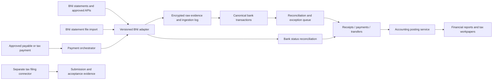

# BNI integration research for OSEE finance ERP

Research date: 7 September 2026. This document separates publicly verified BNI capabilities from proposed ERP behavior. It does not establish OSEE's bank entitlements, register a service, connect a bank account, or initiate any transaction.

User-confirmed context: the legal entity is PT Langkah Pintar Nusantara, and the user intends to obtain BNI API access this week. API access is an immediate onboarding target; specific production scopes and approval rules remain to be verified.

Additional user-confirmed business context: more than 40 mitra act as wholesale resellers, buying tests from OSEE at reported prices around Rp500,000–Rp530,000 and selling onward at their own prices. Provider costs vary. The ERP must distinguish these reseller collections from direct participant/student payments; the reported wholesale range is context, not a hard-coded tariff.

## Decision

Build a bank adapter behind a stable ERP interface, with read-only BNI balance and statement APIs as the initial live integration target. Implement statement-file ingestion alongside it as an operational fallback and migration path. Add invoice-linked virtual accounts next. Introduce payment initiation only after both ERP approvals and the bank's approved authorization arrangement have been tested.

The existence of an OSEE BNIdirect account does not establish API access. BNI describes the portal and API as different integration channels; its API Corporate onboarding has its own forms, contract and security assessment. The user's planned API access this week makes API-first onboarding appropriate, with confirmed statement/balance scopes as the first acceptance gate and file import covering gaps or outages.

## Verified capability and evidence

| Finding | Architectural consequence | Primary source |
|---|---|---|
| BNIdirect cash supports user roles Maker, Approver and Releaser, with token-based transaction authorization. | Maintain named people and separation of duties. Do not turn shared internet-banking credentials or stored OTPs into an ERP connection. | [BNI: BNIdirect](https://www.bni.co.id/id-id/beranda/bnidirect) |
| BNI publishes API BNIdirect services for balances, account statements, beneficiary inquiry, payment status, multiple transfer types, bulk payments and virtual accounts. | These are credible integration candidates, but each required endpoint must be enabled and confirmed for OSEE's contract. | [BNI API BNIdirect catalogue](https://digitalservices.bni.co.id/api-products-detail/api-bnidirect) |
| BNI identifies API account notifications as a service that sends real-time information for registered accounts. It also describes file and API integration channels. | Use notifications for speed and full statement retrieval/import for completeness. Product availability does not prove callback delivery guarantees. | [BNI: Digital Disbursement and Payment Management](https://www.bni.co.id/id-id/korporasi/solusi-wholesale/digital-disbursement-dan-payment-management) |
| The API Corporate product summary printed 11 May 2026 calls for an application, cooperation agreement, IT Security Assessment, and supporting whitelist IP/risk documents; registration opens technical documentation and sandbox testing. | Obtain the current contract-specific documentation before coding security, endpoints, or retry semantics. Budget bank onboarding separately from engineering. | [BNI API Services RIPLAY, pages 1–2](https://www.bni.co.id/Portals/1/BNI/Perusahaan/RIPLAY/UMUM/RIPLAY-API-Service-PADK37.pdf) |
| BNI's current catalogue includes SNAP Virtual Account, SNAP Transfer Credit, account notifications and MPN products. | Choose the smallest approved product combination rather than assuming all legacy and SNAP products share a protocol. | [BNI API products](https://digitalservices.bni.co.id/api-products) |
| The VA product summary printed 30 April 2026 requires a BNI non-individual current account as pooling account, a service application, relevant company documents, acceptance of terms and pricing, and KYC of VA holders. | Confirm OSEE's account type, intended payer model and required customer data before promising invoice-level VA collection. | [BNI Virtual Account RIPLAY, page 2](https://www.bni.co.id/Portals/1/BNI/Perusahaan/RIPLAY/UMUM/RIPLAY_Virtual_Account_Umum-PADK37.pdf) |
| BNI's MPN V2.1 catalogue lists NPWP inquiry, billing creation, inquiry, payment and status checks. | A bank connector can support approved tax payments; SPT preparation and filing require a separate tax connector and evidence. | [BNI MPN V2.1](https://digitalservices.bni.co.id/api-products-detail/api-mpn-v2.1) |
| SNAP standardizes technical/security/data conventions. BI states management moved to ASPI on 1 September 2023; ASPI links to the current developer specifications. | Pin the exact approved bank/SNAP specification and version rather than relying on generic samples or old signature code. | [Bank Indonesia: SNAP](https://www.bi.go.id/id/layanan/Standar/SNAP/default.aspx), [ASPI: SNAP](https://aspi-indonesia.or.id/standar-dan-layanan/standar-open-api-pembayaran-indonesia-snap/) |
| BNI's pricing page advertises starting prices and states transaction fees depend on the cooperation agreement. | Obtain an OSEE-specific quote including API calls, notifications, VA collections and transfer charges. Public examples are not a project quote. | [BNI pricing](https://digitalservices.bni.co.id/pricing) |

Detailed production API schemas, supported statement history window, callback authentication method, retry/idempotency guarantees, rate limits, service-level agreement and approval routing were not publicly verified. Treat each as an onboarding acceptance criterion, not a confirmed bank feature.

## Proposed integration boundaries

The bank module records movement of money. The ledger determines accounting recognition from approved source documents and policy. The tax module determines treatment from the transaction and entity facts. A bank credit is not automatically revenue; it could be an advance, loan, capital contribution, refund or internal transfer. A bank debit is not automatically an expense or a tax-deductible cost.

### Stable application interface

Expose ERP capabilities rather than bank-specific endpoint names:

- `importStatement(account, file, period)` validates a supported bank file and previews its reconciliation impact.
- `fetchTransactions(account, cursorOrPeriod)` records all returned pages and their coverage.
- `fetchBalance(account)` stores balance type and time, including whether it is available or booked balance.
- `createCollectionReference(invoice, collectionPolicy)` requests an invoice-linked VA only when enabled.
- `queryCollection(reference)` checks collection status through the approved bank method.
- `preparePayment(payableVersion)` creates an immutable payment instruction snapshot.
- `submitApprovedPayment(instructionId)` is disabled until the approved bank authorization model is configured.
- `queryPayment(instructionId)` resolves pending and ambiguous outcomes.
- `ingestBankNotification(headers, rawBody)` validates and durably records an incoming event before processing.

Implement file import, inquiry APIs, collection and payment submission as independently enableable capabilities. Keep read access separate from payment credentials where BNI supports it. Include an emergency switch that blocks outbound instructions while preserving read and reconciliation functions.

### Canonical bank transaction record

Store `entity_id`, `bank_account_id`, `provider`, `provider_product`, `schema_version`, `provider_transaction_id`, `provider_reference`, `statement_id`, `source_row_id`, `booking_date`, `value_date`, `provider_timestamp`, `received_at`, `direction`, `currency`, exact-decimal `amount`, available counterparty/reference fields, `reversal_of`, `raw_evidence_id`, `ingestion_batch_id`, and `reconciliation_status`.

Store the raw response/file immutably with an integrity hash and access restrictions. Store source coverage separately: which account, period, pages, opening/closing balance and totals were obtained. Mask account and identity data in ordinary logs.

Use provider identifiers when they are guaranteed stable. Where files omit unique transaction IDs, a deduplication strategy must distinguish identical legitimate transfers: use statement identity and row provenance, preserve overlap evidence, and surface collisions. Date plus amount plus description is insufficient as the sole uniqueness key.

## Reconciliation design

1. Ingest notifications promptly and poll/import statements on a controlled schedule. The target operational experience is current balances with clear timestamps, not an unsupported promise of instantaneous complete data.
2. Normalize without silently changing money, dates, currency, fees or debit/credit direction. Quarantine malformed records.
3. Match an invoice-specific collection reference first, then a bank/payment reference, then a previously approved matching rule. Amount/date/name similarity may suggest matches but should not silently settle ambiguous invoices.
4. Support one payment across several invoices, multiple payments against one invoice, partial amounts, overpayments, bank fees, refunds, reversed transfers, and gross-versus-net receipts. Model allocation as its own record.
5. For tuition, connect payer, student, enrollment and invoice separately. A parent's name differing from the student's name must not prevent matching; a single payer may pay for siblings.
6. An identified receipt clears receivables or records an advance according to its source document. An unidentified credit posts only to an approved suspense/unallocated-receipt account, with an owner and resolution deadline. It must not inflate sales.
7. Pair internal transfers between OSEE bank accounts using a transfer clearing account so they do not create revenue or expenses. Recognize any actual bank fee separately.
8. At day end, compare bank opening balance plus credits minus debits with bank closing booked balance, subject to the statement's sign convention; compare the ledger bank control account after outstanding items. Missing periods and incomplete pages must keep the account visibly unreconciled.
9. At month close, produce outstanding deposits/payments, unmatched transactions, stale feeds, reversals, and a reconciliation sign-off. Block final close for incomplete bank evidence or unresolved material differences under the approved close policy.

Payment notification and statement observation of the same money movement must converge on one settlement record. A duplicate callback, file re-upload, overlapping poll or worker retry must not create a second receipt or journal.

## Collections for tuition and corporate training

Prefer an invoice-linked VA or equivalent unique bank collection reference when commercially and technically available. This gives reconciliation a reliable identity even when parents use different sender accounts. For installments, model the schedule in the ERP and select the bank's available VA mode only after BNI confirms expiry, repeat use, exact/variable amount, partial payment, adjustment and cancellation semantics.

For corporate training customers who withhold income tax, cash received may be lower than the invoice. Allocation must separate bank cash and a withholding-tax receivable/credit supported by the customer's withholding evidence. It must not automatically discount the invoice or falsely flag a small underpayment. The tax module validates the credit independently.

The enrollment service consumes a finance event only after collection has reached the configured confirmed state. A payment screenshot or an unauthenticated callback is supporting material, not authoritative settlement. If a bank later reverses a payment, the ERP opens a reversal task with the original allocations and journal references preserved.

### Wholesale mitra collections, receivables and deposits

For a reseller sale, identify the mitra legal/customer account as the debtor and usually the payer. Link the test participant as the service beneficiary. A participant's retail payment to the mitra is not automatically a bank receipt or a receivable settlement of PT Langkah Pintar Nusantara. OSEE's expected bank amount follows the approved wholesale invoice, including applicable tax, credit notes and approved adjustments. The mitra's retail markup is not imported as OSEE revenue merely because participant details are present.

Support three commercial modes per approved mitra agreement:

| Mode | Bank collection and ERP treatment | Release control |
|---|---|---|
| Pay per invoice/order batch | Unique VA/payment reference identifies the mitra and a batch invoice; one receipt may settle many test-order lines. | Release the relevant orders only after required settlement evidence, or an approved credit override. |
| Prepaid mitra deposit | Unique top-up reference identifies the mitra account. Confirmed cash creates a customer deposit/contract liability, allocated later to orders. | Reserve available deposit atomically for each order; consume/recognize according to approved fulfillment policy. |
| Approved credit terms | Invoice creates reseller receivables with due date and credit limit. A later batch payment can settle several invoices. | Check credit limit and overdue policy independently from participant registration. |

Do not collapse these modes into a single paid/unpaid checkbox. Preserve `mitra_id`, `contract_version`, `wholesale_price_version`, `order_batch_id`, `test_order_id`, `participant_id`, `invoice_id`, `collection_reference`, `receipt_id`, `deposit_account_id`, and allocation/reservation references. Where multiple mitra share a payer or a parent company pays for several accounts, require an explicit approved allocation instruction rather than matching only on sender name.

For one transfer covering many test orders, keep a batch allocation manifest with totals, line quantities, invoice balances and the matching decision. Allow receipt splitting among invoices and deposit top-up only under an explicit allocation rule. An unidentified bulk transfer remains unallocated cash; it must not release all orders that happen to share its amount. A VA can identify an invoice or a mitra top-up; select the granularity against BNI's contracted VA modes, costs and reuse rules. A persistent mitra VA alone does not establish which of several invoices a receipt pays.

For deposits, separate confirmed balance, reserved amount, consumed amount, refund in progress and available balance. Concurrent order acceptance must lock or version the same deposit control balance, preventing two orders spending one balance. A cancellation releases an unused reservation or creates an approved credit/refund; it must not directly edit the historical receipt. Restrict transfers of deposit credit between mitra accounts and require review for refunds to a different beneficiary account. This is an internal accounting subledger for OSEE customer advances; any broader transferable stored-value product would require separate design and assessment.

Provider costs are separate payable facts. Version provider price, currency, effective date, taxes and source quotation for each committed test order/batch. Record actual supplier invoice costs and variances rather than computing a fixed margin from the Rp500,000–Rp530,000 selling range. A mitra receipt, supplier payment, test entitlement and fulfillment are distinct events with independent states and links. The supplier-payment bank instruction can group many orders, but it must preserve item-level cost/payable references and partial-success behavior.

The nontechnical mitra screen should show only useful facts: “Available deposit,” “Reserved for tests,” “Outstanding invoices,” “Overdue,” “Orders ready,” and “Payments needing allocation.” Finance can open a bank receipt and see exactly which mitra invoices/orders it settled. Operations sees fulfillment eligibility without needing access to bank credentials, supplier margins or tax identity fields.

## Payment control and failure handling

Proposed states:

`Draft → Awaiting ERP approval → Approved → Awaiting bank authorization (when required) → Submitted → Pending/Unknown → Confirmed paid | Confirmed failed`

Additional controlled states include `Cancelled before submission`, `Expired approval`, and `Reversed`. Keep business approval, bank acceptance, payment completion, statement reconciliation and tax-filing status separate.

- Freeze entity, source account, beneficiary, beneficiary bank, amount, currency, withholding, invoice versions and payment date into a signed/auditable approval snapshot. A material change invalidates approval.
- Approval policy considers amount, account, payment type and related party. A maker must not approve their own payment. Check the bank account through the approved beneficiary inquiry and require separate approval for beneficiary account changes.
- Record the business instruction and an outbox entry atomically before attempting transmission. Use a stable internal business idempotency key and the bank's required request references, whose retry semantics must be documented separately.
- Persist a unique dispatch attempt and its exact bank reference before network transmission. A worker crash or expired lease during an attempt is an uncertain external outcome even if no HTTP timeout was received; route it to inquiry rather than ordinary outbox retransmission. A new worker lease is not authorization to repeat a money movement.
- A transport timeout means the outcome is unknown. Do not automatically create a fresh payment request. Query the original transaction using its retained references, reconcile statements, and escalate if ambiguity remains. Disable a second manual submit for that instruction while unresolved.
- Do not assume HTTP 200 means money was paid, or that an absent statement row means payment failed. Interpret the approved bank status vocabulary and settlement evidence.
- Bulk payments require per-item states. A partly successful batch must retry only confirmed failed items, under the bank contract's documented procedure, without repeating successful payments.
- On account credentials/certificates expiry, preserve pending instructions and alert support. The user should see the bank connection issue and its financial consequence, with no secret values exposed.
- Support file export for bank upload if BNI supplies an approved format. Fingerprint each exported batch, record uploader/releaser and completion evidence, and reconcile it with the same payment instructions. Export must not mark items paid.

Preserve enough outbound instruction, approval and dispatch-reference evidence in a separately recoverable durable journal before transmission to resolve external effects after restoring the operational database. If the operational database has a nonzero recovery-point window, bank-side effects during that window may survive while local state is lost. Recovery must reconcile from the restore watermark through the incident freeze before outbound payments resume. Reversal processing must work after either payment confirmation or statement reconciliation, including when the original period is already closed.

BNI's web role model does not prove that every API payment passes through the same web approval queue. Confirm the selected API's signing and approval model in writing. Until then, use ERP preparation plus bank-side human release, or leave payment submission disabled. Never implement browser scraping of bank credentials or automate token entry as the architecture's integration method.

## Callback and credential security requirements

These are proposed ERP controls, not claims about a specific public BNI endpoint:

- Enforce TLS; implement the exact selected product's message authentication, token, timestamp and canonicalization rules. Do not copy legacy JWT examples into a SNAP integration without review.
- Verify the raw request according to the contracted signature format before trusting its financial fields. Apply replay detection and allowed timestamp skew according to bank requirements.
- Apply BNI-approved network restrictions, stable outbound IPs where required and any specified mutual TLS. IP filtering supplements message authentication.
- Durably store validated notification identity before acknowledging success, then process asynchronously. Use bank-compatible response codes and retry handling. Reject invalid signatures without updating finance data.
- Keep encryption keys, signing keys and API credentials in a managed secret store; rotate with overlap where supported. Separate sandbox and production access.
- Record correlation IDs, status transitions and sanitized errors. Restrict raw payload access to authorized operations/audit staff, with data retention aligned to the ERP's approved legal policy.
- Test duplicate, delayed, reordered, malformed and forged notifications; verify no duplicate settlement and no silent loss during database or worker outages.

## Tax boundary

An MPN payment connector may prepare or pay an approved tax billing code if enabled. The ERP must retain the exact entity/taxpayer, tax type, period, billing reference, approved amount, bank transaction reference and authoritative payment evidence, including the relevant receipt/validation identifiers returned by the contracted service.

Payment does not prove an SPT was submitted or accepted. Keep separate records for tax workpaper approval, billing, payment, return generation, submission and acceptance, and show which one remains outstanding. The annual return cannot be derived solely from bank transactions: it depends on the complete ledger, accruals, noncash adjustments, assets, liabilities and validated fiscal treatment.

## Staged release and acceptance gates

| Stage | User outcome | Acceptance gate |
|---|---|---|
| 1. Read-only BNI connection | Statements and balances arrive automatically for PT Langkah Pintar Nusantara. | BNI production statement/balance scopes confirmed; full period coverage, pagination, outages, overlap and gap recovery tested; credentials monitored. |
| Parallel foundation: controlled file ingestion | Upload a bank statement when migrating history or recovering from an outage; see automatic matches and a short exception list. | Real bank sample parsed without changing totals; re-upload and overlap with API data are safe; opening/closing balances tie; ambiguous duplicate rows are visible. |
| 3. Collection references | Student/corporate receipts match invoices with much less investigation. | VA mode, fees, pooling and customer-data requirements confirmed; partial/over/late/duplicate/reversal cases verified. |
| 4. Payment preparation and controlled release | Finance approves a prepared payment with full tax and invoice context. | ERP approval segregation, bank authorization routing, beneficiary-change controls and audit evidence accepted. |
| 5. Approved API payments and MPN | Approved instructions move without retyping; outcomes and payment evidence return automatically. | Timeout/status/duplicate/bulk-partial scenarios proven with bank sandbox and controlled production pilot; no unknown result can be retried blindly. |

## Bank onboarding checklist for a concrete BNI discussion

Request a written product/entitlement matrix for OSEE: account ownership and type; BNIdirect cash/bisnis/API product; statement/balance/notification availability; allowed account scopes; VA pool and invoice modes; transfer rails; MPN version; sandbox and production onboarding; security checklist; static IP/mTLS/key requirements; service and maintenance hours; historical-data windows; paging and transaction identifiers; notification retry/replay policy; statement completeness guarantees; rate limits; status vocabulary and finality; idempotency window; timeout recovery; bulk item status; API versus portal approval model; support escalation and dispute evidence; statement/file export formats; pricing and minimums; and production go-live acceptance criteria.

Cost model inputs should include account count, sync frequency, pages per sync, notification volume, invoices/VA transactions, transfer rail mix, failed/status inquiry traffic, history backfills and support. Use negotiated prices, with a budget alert and controlled polling schedule. Avoid making a marketing claim such as unlimited traffic an engineering rate-limit assumption.

## What remains unverified

The legal entity is confirmed as PT Langkah Pintar Nusantara. Its bank account type and ownership match, completed API contract and enabled scopes, historic statement exports, data volumes, callback delivery/security schemas, account limits, specific bank approval routing, current enterprise pricing, and approved hosting/network configuration still require confirmation before production integration. These uncertainties do not prevent finance and reconciliation implementation with a bank simulator and statement fallback.
